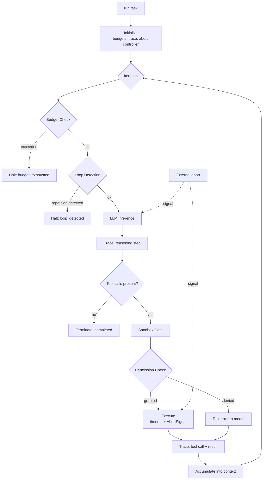

# agent-runtime

> Agent execution runtime: bounded reasoning loops, resource budgets, tool-call sandboxing, full execution traces, and cooperative cancellation.

[](https://www.typescriptlang.org/)
[](https://nodejs.org/)
[](LICENSE)
[](#project-status)

## Project Status

**Work in progress.** The execution loop, budget enforcement, termination detection, and trace recording are implemented. Process-level isolation and the trace viewer are in development.

## Problem

An agent loop is trivial to write and difficult to run safely. The naive version is five lines:

```typescript
while (true) {
  const response = await llm.complete(messages);
  if (!response.tool_calls) return response;
  messages.push(...await executeTools(response.tool_calls));
}
```

Every one of those lines is a production incident:

- **`while (true)`** — the agent loops forever calling `list_files` on the same directory, burning tokens until someone notices the bill.
- **No budget** — there is no bound on tokens, wall-clock time, cost, or tool invocations.
- **`executeTools`** — tools run with the full privileges of the host process. A `read_file` tool with no path restriction reads `/etc/passwd` and `.env`.
- **No cancellation** — a user closes the tab and the agent keeps spending money for another four minutes.
- **No trace** — when the agent does something unexpected, there is no record of why.

This runtime is that loop with each failure mode addressed explicitly.

## Architecture



## Core Mechanics

### Budget Enforcement

Four independent budgets, each checked before every iteration. The first to trip halts the run:

| Budget | Guards Against |
|--------|----------------|
| `maxIterations` | Infinite reasoning loops |
| `maxTokens` | Context growth and token spend |
| `maxCostUSD` | Direct financial exposure |
| `maxWallClockMs` | User-visible latency, hung tools |

Budgets are checked *before* the expensive operation, not after. Checking afterward means the run always exceeds its budget by exactly one inference, which is the single most expensive step.

Each budget reports remaining capacity, so a handler can adapt: an agent with 5% of its token budget left should be summarizing, not starting new subtasks.

### Loop Detection

Budget limits catch runaway loops eventually, but expensively. Structural detection catches them in two or three iterations:

**Exact repetition.** The same tool called with identical arguments, N times consecutively. Almost always a stuck agent, since a deterministic tool returns the same answer.

**Cyclic patterns.** A repeating sequence such as `A → B → A → B → A → B`. Detected by hashing recent call signatures and looking for a repeating period.

**No-progress heuristic.** Tool calls continue but the accumulated result set stops changing. The agent is active but not advancing.

Detection returns a *reason*, which is then given to the model as a system observation. Telling the agent "you have called `search` with the same query three times and received the same result" frequently unsticks it, whereas silently halting just fails the task.

### Sandbox Gate

Every tool call passes a permission check before execution. Permissions are declarative and deny-by-default:

```typescript
permissions: {
  filesystem: {
    read:  ['./workspace/**'],
    write: ['./workspace/output/**'],
  },
  network: {
    allow: ['api.internal.example.com'],
  },
  tools: {
    deny: ['execute_shell'],
  },
}
```

Path patterns are resolved and canonicalized before matching, so `./workspace/../../../etc/passwd` is rejected rather than matched against the literal prefix. Symlinks are resolved for the same reason: a symlink inside the allowed directory pointing outside it would otherwise defeat the check.

This is a policy gate, not a security boundary. It stops accidents and prompt-injected misuse of legitimate tools. It does not contain a tool that is itself malicious, since a tool runs as real code in the process. For genuinely untrusted tools, process or container isolation is required, and that is on the roadmap.

### Cooperative Cancellation

A single `AbortSignal` propagates to the LLM call and to every tool handler. Cancellation is checked at three points: before inference, before each tool call, and inside handlers that respect the signal.

Handlers that ignore the signal are still bounded by their timeout, but they waste resources until it fires. The runtime records which handlers ignored cancellation, because that is a bug worth fixing rather than tolerating.

### Execution Traces

Every run produces a complete, replayable trace: each reasoning step, each tool call with arguments and results, each budget snapshot, each permission decision. Traces are the difference between "the agent did something weird" and "the agent called `search` with the user's raw input at step 4, got no results, and then hallucinated a plausible answer at step 5".

## Installation

```bash
npm install @q1-digital/agent-runtime
```

## Quick Start

```typescript
import { AgentRuntime } from '@q1-digital/agent-runtime';
import { z } from 'zod';

const runtime = new AgentRuntime({
  budgets: {
    maxIterations: 15,
    maxTokens: 100_000,
    maxCostUSD: 2.00,
    maxWallClockMs: 120_000,
  },
  loopDetection: {
    enabled: true,
    exactRepetitionThreshold: 3,
    cycleDetectionWindow: 8,
    notifyModel: true,        // Tell the agent it is stuck instead of silently halting
  },
  permissions: {
    filesystem: {
      read: ['./workspace/**'],
      write: ['./workspace/output/**'],
    },
    network: { allow: ['api.internal.example.com'] },
    tools: { deny: ['execute_shell'] },
  },
  tracing: { enabled: true, captureArguments: true, redactPatterns: [/api[_-]?key/i] },
});

runtime.tool({
  name: 'read_file',
  description: 'Read a UTF-8 text file from the workspace.',
  input: z.object({ path: z.string() }),
  requires: { filesystem: 'read' },   // Checked against permissions before running
  timeoutMs: 5_000,
  handler: async ({ path }, ctx) => {
    ctx.logger.debug('reading', { path });
    return fs.readFile(path, { encoding: 'utf8', signal: ctx.signal });
  },
});

const result = await runtime.run({
  task: 'Summarize every markdown file in the workspace and write the summary to output/summary.md',
  model: 'claude-sonnet-4-20250514',
  systemPrompt: 'You are a documentation assistant.',
});

console.log(result.status);      // 'completed' | 'budget_exhausted' | 'loop_detected' | 'aborted' | 'error'
console.log(result.output);
console.log(result.iterations);
console.log(result.usage);       // { tokens, costUSD, wallClockMs, toolCalls }
console.log(result.budgetsRemaining);
```

### Cancellation

```typescript
const controller = new AbortController();

// User navigates away
request.on('close', () => controller.abort('client disconnected'));

const result = await runtime.run({
  task: '...',
  model: 'claude-sonnet-4-20250514',
  signal: controller.signal,
});

if (result.status === 'aborted') {
  console.log(result.abortReason);
  console.log(result.usage.costUSD);  // What was spent before stopping
}
```

### Observing a Run

```typescript
runtime.on('iteration', ({ index, budgetsRemaining }) => {
  if (budgetsRemaining.tokensPercent < 0.1) {
    console.warn(`Iteration ${index}: under 10% token budget`);
  }
});

runtime.on('permission:denied', ({ tool, requested, reason }) => {
  console.warn(`Blocked ${tool}: ${reason}`, requested);
});

runtime.on('loop:detected', ({ pattern, iterations, notifiedModel }) => {
  console.warn(`Loop after ${iterations} iterations: ${pattern}`);
});
```

### Inspecting the Trace

```typescript
for (const step of result.trace.steps) {
  switch (step.type) {
    case 'reasoning':
      console.log(`[${step.index}] thought (${step.tokens} tokens)`);
      break;
    case 'tool_call':
      console.log(`[${step.index}] ${step.tool}(${JSON.stringify(step.arguments)})`);
      console.log(`      -> ${step.ok ? 'ok' : step.error.code} in ${step.latencyMs}ms`);
      break;
    case 'permission_denied':
      console.log(`[${step.index}] DENIED ${step.tool}: ${step.reason}`);
      break;
  }
}

// Serialize for storage or a viewer
await fs.writeFile('trace.json', JSON.stringify(result.trace, null, 2));
```

## Configuration

```typescript
interface RuntimeConfig {
  budgets: {
    maxIterations: number;
    maxTokens: number;
    maxCostUSD: number;
    maxWallClockMs: number;
  };
  loopDetection?: {
    enabled: boolean;
    exactRepetitionThreshold: number;
    cycleDetectionWindow: number;
    notifyModel: boolean;
  };
  permissions?: {
    filesystem?: { read?: string[]; write?: string[] };
    network?: { allow?: string[]; deny?: string[] };
    tools?: { allow?: string[]; deny?: string[] };
  };
  tracing?: {
    enabled: boolean;
    captureArguments: boolean;
    redactPatterns?: RegExp[];
  };
}
```

## Project Structure

```
src/
├── core/
│   ├── runtime.ts                  # Execution loop + event emitter
│   ├── iteration.ts                # Single reasoning cycle
│   ├── termination.ts              # Completion + halt conditions
│   └── config.ts                   # Zod schemas
├── budgets/
│   ├── budget-manager.ts           # Multi-dimension tracking
│   ├── token-counter.ts            # tiktoken-based accounting
│   └── cost-tracker.ts             # Per-model pricing
├── safety/
│   ├── loop-detector.ts            # Repetition + cycle + no-progress
│   ├── permission-gate.ts          # Declarative policy evaluation
│   └── path-resolver.ts            # Canonicalization, symlink + traversal defence
├── execution/
│   ├── tool-executor.ts            # Timeout + signal wiring
│   └── cancellation.ts             # AbortSignal propagation
├── tracing/
│   ├── trace-recorder.ts           # Step capture
│   ├── redactor.ts                 # Secret scrubbing in traces
│   └── serializer.ts               # Portable JSON format
└── index.ts
```

## Design Decisions

**Why four budgets instead of one?** They fail independently. An agent can hit a cost ceiling in three iterations with a large model, or run forty cheap iterations without approaching it. A single budget forces a bad proxy for whichever constraint actually matters.

**Why check budgets before inference rather than after?** Checking afterward means every run exceeds its limit by one inference. Since inference is the most expensive step, the overshoot is the largest possible.

**Why tell the model it is stuck instead of just halting?** Because "you have called `search` with the same query three times and received the same result" is actionable information, and models frequently recover from it. Silently halting converts a recoverable situation into a failed task.

**Why canonicalize paths before matching?** Prefix matching on raw input is defeated by `../` and by symlinks. Resolving to an absolute real path first turns a string comparison into an actual containment check.

**Why call the sandbox a policy gate rather than a security boundary?** Because it is honest. Tools execute as in-process code, so a malicious tool is not contained by an argument check. The gate stops accidents and injected misuse of legitimate tools, which is genuinely valuable, but conflating that with isolation would give users false confidence.

**Why record handlers that ignore cancellation?** Because it is a latent bug. It surfaces as wasted spend and slow shutdowns long before anyone connects it to a handler that never checked its signal.

**Why make traces the default rather than opt-in?** The moment you need a trace is always after the incident. Tracing off by default guarantees it is off exactly when it matters.

## Roadmap

- [ ] Process-level isolation for untrusted tools
- [ ] Trace viewer UI with step-through replay
- [ ] Checkpoint and resume for long-running tasks
- [ ] Sub-agent spawning with inherited, subdivided budgets
- [ ] Deterministic replay from a recorded trace
- [ ] OpenTelemetry span export per iteration

## License

MIT
